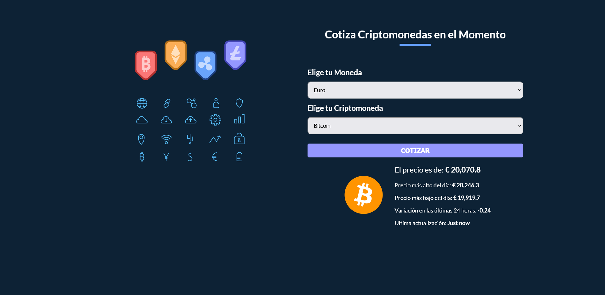
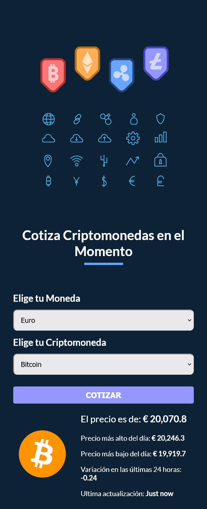

# Cotizador de Criptos

## Table of contents

- [Cotizador de Criptos](#cotizador-de-criptos)
  - [Table of contents](#table-of-contents)
  - [Capturas](#capturas)
  - [Links](#links)
  - [Construido con](#construido-con)
  - [Autor](#autor)

## Capturas

  

  

## Links

- [Sitio Online](https://rococo-gumption-4f5610.netlify.app/)

## Construido con

- Vite
- React
- Styled Components
- API de CryptoCompare
- SpinKit | Simple CSS Spinners

## Autor

- Linkedin - [@lucasscattolin](https://www.linkedin.com/in/lucas-scattolin/)
- Twitter - [@lucasscattolin](https://www.twitter.com/lucasscattolin)

